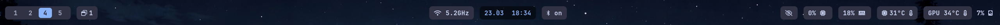
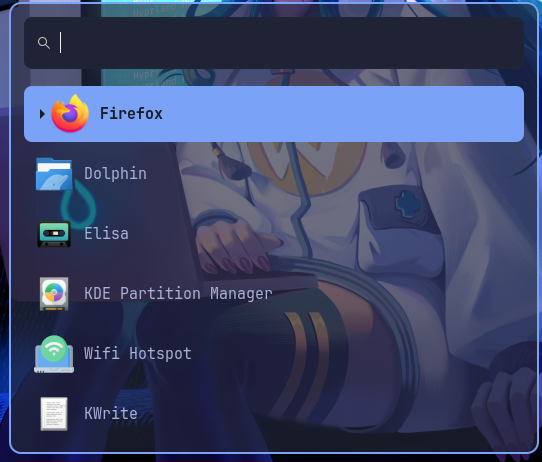

# swayfx-config

A personal Linux desktop configuration repo for a clean, minimal, and highly customizable Sway-based setup.


This repository collects my configuration files for the desktop, including:

* **Sway / SwayFX** window manager setup
* **Waybar** status bar styles and layouts
* **Alacritty** terminal themes
* **Wofi** launcher styling
* **Fastfetch** configuration
* Shell aliases and small helper scripts

---

## Preview

Add screenshots of your desktop here so people can see the theme, bar, launcher, and terminal at a glance.







---

## Installation

You will need to install the following packages:

swayfx
alacritty
wofi
fastfetch
waybar
nerd font
swayosd
grim
slurp
cliphist


1. Clone the repository:

```bash
git clone https://github.com/Projekt-Boss/swayfx-config.git
cd swayfx-config
```

2. Copy the files to the correct config locations.

Examples:

```bash
mkdir -p ~/.config
cp -r sway ~/.config/
cp -r waybar ~/.config/
cp -r alacritty ~/.config/
cp -r wofi ~/.config/
```

3. Make scripts executable if needed:

```bash
chmod +x sway/changeWallpaper.sh gitBackupConfig.sh
```

4. Restart Sway or reload the config:

```bash
swaymsg reload
```

---


## Notes

This repository is meant as a personal desktop configuration and theme archive. Feel free to use parts of it as a starting point for your own setup.

---
